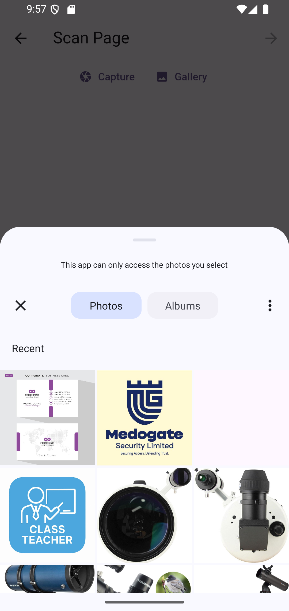
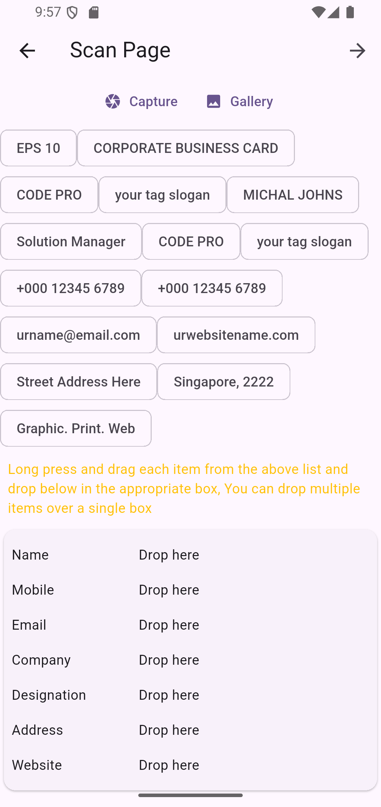
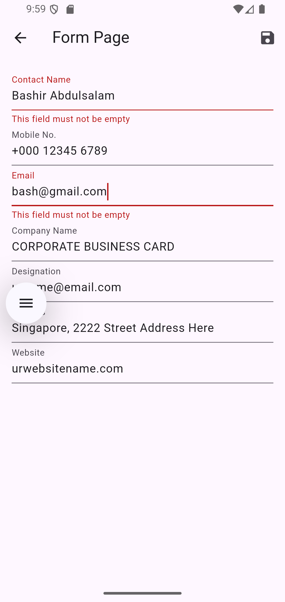
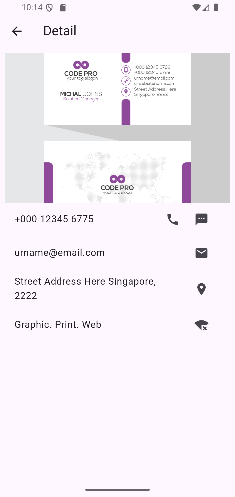

# Virtual Card Keeper  

  
  
  
  

A simple and secure **virtual card keeping app** that allows users to store, organize, and manage their important cards (ID cards, business cards, membership cards, etc.) digitally in one place.  

---

## **Features**  
  
- 🗂 **Card Categories**: Organize cards by type (All and Favorite). 
- 📷 **Scan & Extract Info**: Scan physical cards (using OCR) and automatically extract details.
- ✏️ **Edit Card Details**: Modify card information after scanning or adding manually.  
- 📶 **Offline Access**: Access your cards without internet.  

---

## **Tech Stack** 
- **Frontend**: [Flutter](https://flutter.dev/) (Dart)  
- **Backend**: Local SQLite  

---

## 📸 Screenshots

  







---

## 🎥 Demo Video / GIF

- **GIF Example:**


---

### **For Developers**  
```bash
# Clone the repository
git clone https://github.com/BashLaw-Cyber/Virtual_Card_Record.git
cd VCARD

# Install dependencies
flutter pub get

# Run the app
flutter run